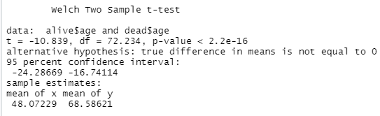
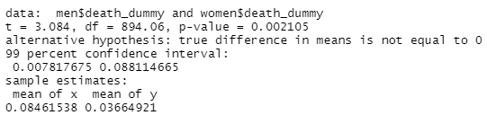

# Covid-19-Analysis-in-R
Analysis of Covid-19 with R.

Coronavirus disease (COVID-19) is an infectious disease caused by the SARS-CoV-2 virus.

Most people infected with the virus will experience mild to moderate respiratory illness and recover without requiring special treatment. However, some will become seriously ill and require medical attention. Older people and those with underlying medical conditions like cardiovascular disease, diabetes, chronic respiratory disease, or cancer are more likely to develop serious illness. Anyone can get sick with COVID-19 and become seriously ill or die at any age. 

This project compares the effect of Covid-19 on the basis of age and Gender with the help of Hmisc library and the t-test in R studio.

Technologies used - R, R Studio, Hmisc Library.

Analyis of Age
Claim : People who die are older than the people who survive.

Welch Sample t-test

#### 95 % confidence interval: normally if p-value < 0.05, we reject the null hypothesis here p-value ~ 0, so we reject the null hypothesis the claim that people who die are older than people who survive is statistically significant.

Analysis of Gender 
Claim : Gender has no effect on the death occurred by corona virus.

Welch Sample t-test

#### 99 % confidence interval: men have from 0.8% to 8.8% higher chance of dying. p-value = 0.002 < 0.05, so we reject the null hypothesis, we can reject the claim that gender has no effect on the death rate. 
#### Men have a higher death rate than women.
